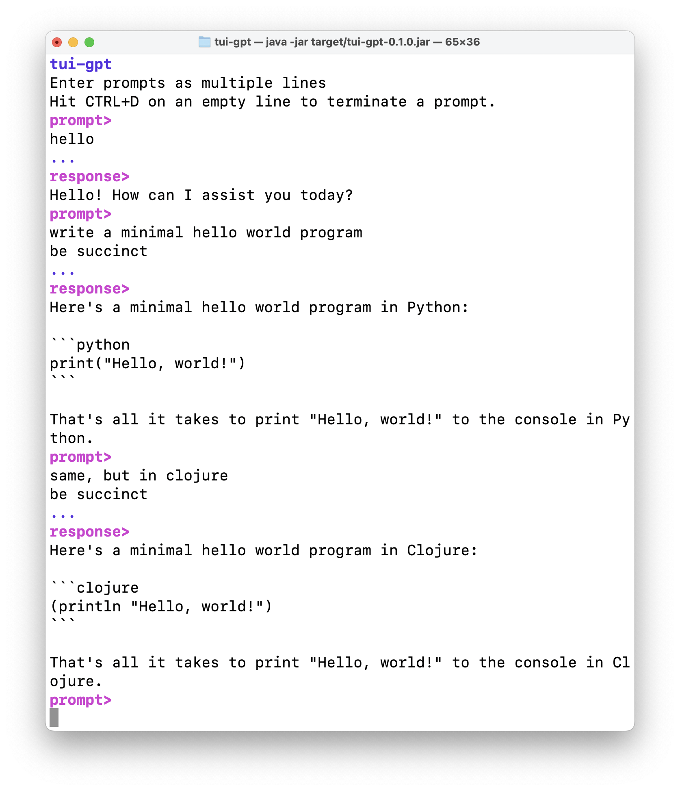

# me.pmatiello/tui-gpt

GPT chat in the terminal to exercise both
[me.pmatiello/tui](https://github.com/pmatiello/tui) and
[me.pmatiello/openai-api](https://github.com/pmatiello/openai-api).

**Notice:** This is not an official OpenAI project nor is it affiliated with OpenAI
in any way.



## Development

Information for developing this library.

### Running tests

The following command will execute the unit tests:

```
% clj -X:test
```

### Running

The following command will execute the application:

```
% clj -M:run-cli
```

### Building

The following command will build a jar file:

```
% clj -T:build jar
```

This jar file can be executed with this command:

```
% java -jar target/tui-gpt-${VERSION}.jar
```

To clean a previous build, run:

```
% clj -T:build clean
```

## Contribution Policy

This software is open-source, but closed to contributions.
